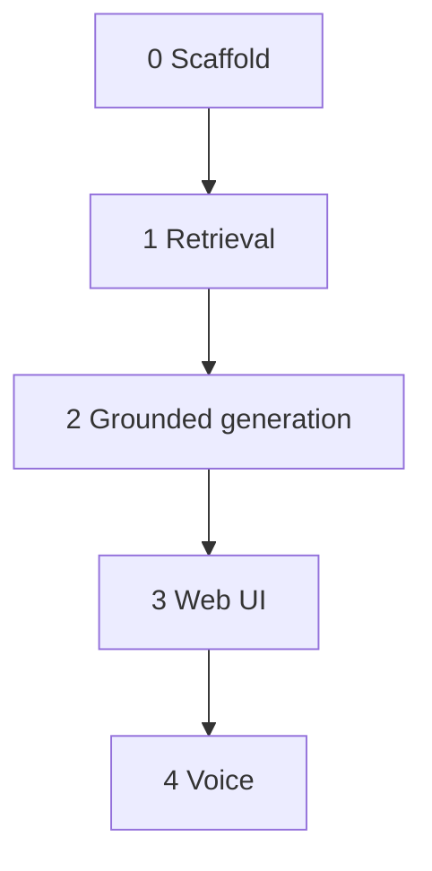

# Implementation tasks

The repo starts from `docs/architecture.md` only. Implement these slices in order. Finish and verify one slice before starting the next.

Later items in the architecture (hybrid search, reranking, memory, streaming, evaluation) stay out of these slices.

## 0 — Scaffold

Empty Next.js app, no RAG yet.

1. [x] Next.js + TypeScript app with strict `tsconfig`, installed with yarn.
2. [x] Folder layout: `src/app`, `src/components`, `src/lib/rag`, `src/lib/qdrant`, `src/lib/llm`, `src/types`, `scripts`, `knowledge`.
3. [x] Shared types in `src/types/rag.ts` (`Chunk`, retrieved hit, ask request/response).
4. [x] One config module for `TOP_K`, `SIMILARITY_THRESHOLD`, `CHUNK_SIZE`, `CHUNK_OVERLAP`.
5. [x] `.env.example` and `.gitignore` for `QDRANT_URL`, `QDRANT_API_KEY`, `EMBEDDING_API_KEY`, `LLM_API_KEY`.
6. [x] Seed knowledge: `clinic.md`, `doctors.md`, `departments.md`, `appointments.md`, `faq.md`.

## 1 — Retrieval only

Verify search before any LLM or UI.

7. [x] `chunk.ts` — deterministic split of a string into `Chunk[]`. No API calls.
8. [x] `embed.ts` — `embedText(text)` against a cloud embedding API.
9. [x] `qdrant/client.ts` — collection setup and upsert.
10. [x] `scripts/ingest.ts` — `yarn ingest`: read `/knowledge`, chunk, embed, store vectors plus `source`, document type, chunk index, and original text.
11. [x] `retrieve.ts` — Qdrant top-K search, return text, metadata, and scores.
12. [x] `yarn test:retrieval` — print question, chunks, scores, and source files.
13. [x] Basic errors for missing env, Qdrant, embedding failures, and empty questions. Server logs for question, embedding, chunks, and scores. No secrets in logs.

**Done when** a clinic question returns the right markdown sources with scores, and the LLM is still unused.

## 2 — Grounded generation

14. [x] `prompt.ts` — answer only from clinic context; say the knowledge base does not contain the answer when it does not.
15. [x] `llm/client.ts` and `generate.ts` — question plus retrieved context in, answer out.
16. [x] `rag.ts` — `answerQuestion(question)` runs embed, retrieve, prompt, generate.
17. [x] Drop results below `SIMILARITY_THRESHOLD` and return the insufficient-context answer without calling the LLM.
18. [x] Check one in-scope question (department hours) and one out-of-scope question (personal medical treatment).

## 3 — Web UI

19. [x] `POST /api/ask` — `{ question }` in, `{ answer, sources }` out. Keys stay on the server.
20. [x] Simple page: title, text input, Ask button, loading state, answer, sources with similarity scores, and visible errors.

**Done when** text Q&A works with no microphone.

## 4 — Voice

21. [x] `VoiceInput.tsx` — browser Speech Recognition fills the question and calls the same ask flow.
22. [x] Speech Synthesis button reads the answer aloud.
23. [x] If speech recognition is missing, show an error and leave text input working.
